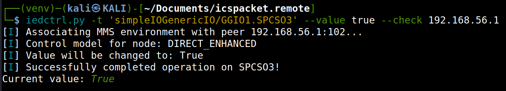
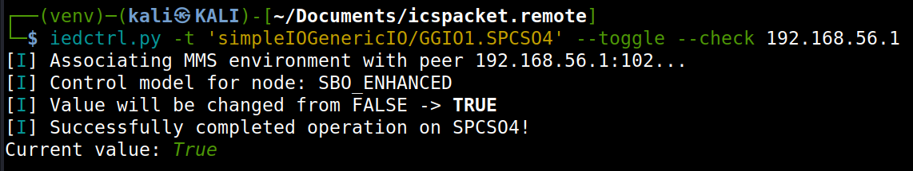

.. _iec61850_example_iedctrl:

Operating on IEDs
=================

`iedctrl` is a command-line utility to perform control operations on IEC61850 IEDs.
Supports selecting, operating, and optionally querying values after execution.

Usage
-----

.. code-block::

    ied_operate.py -t [LDName/]LNName.[FC].DataName --value VALUE [--check] <host>
    ied_operate.py -t [LDName/]LNName.[FC].DataName --toggle [--check] <host>

Examples
--------

Operate a control object with a specific value:

Toggle a boolean control object:

Notes
-----

- The ``target`` argument supports specifying logical device (LD), logical node (LN), functional constraint (FC), and data name. If the LD is omitted, the default LD will be queried first.
- JSON is used to represent structured values. Files containing JSON can also be passed instead of inline JSON strings.
- The ``--check`` option ensures the tool reads back the value after the control operation to verify success.
