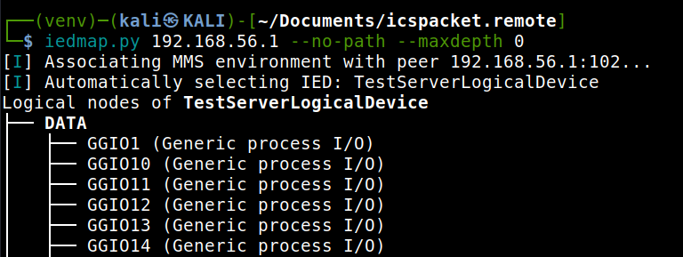

.. _iec61850_example_iedmap:

Enumerating IEDs
================

The ``iedmap`` utility provides a structured way to **enumerate and inspect
Intelligent Electronic Devices (IEDs)** using the IEC 61850 protocol together
with MMS over TCP. It allows to traverse the hierarchical information model of
an IED and extract details about its logical structure.

IEC 61850 Background
--------------------

IEC 61850 defines a **layered data model** built around the following concepts:

- **Logical Devices (LDs)**: Abstractions that represent major functional
  groupings inside an IED - equivalent to MMS domain objects.
- **Logical Nodes (LNs)**: Each LN represents a specific function (e.g.,
  measurement, control, protection)
- **Data Objects and Data Attributes**: Hierarchically organized information
  points that carry actual values and metadata - equivalent to MMS named
  variables and named variable lists.

The result is a **tree of nodes, and variables** for a target logical device, which
can be displayed in either structured or flat form.

Usage
-----

.. code-block:: bash

    iedmap.py [OPTIONS] <host> [-p <port>]

Where ``<host>`` specifies the IED (IP address or hostname), and ``port``
(default 102) is the MMS communication port.

    Sample output that displays only nodes at depth zero.

Output Options
--------------

The following arguments control how information is displayed:

.. option:: -L, --list

    Output all discovered nodes as a **flat list** rather than a hierarchical table/tree.

    .. note::
        This option does not respect the ``--maxdepth`` option.

    .. figure:: _images/iedmap-enum-list.png
        :align: center

        List output of all logical nodes within the device or the selected node.

.. option:: --maxdepth DEPTH

  Limit the displayed hierarchy to a maximum **node depth**.

.. option:: --no-path

  Suppress the display of **fully qualified paths** for nodes.
  Normally, paths such as ``LD1/MMXU1.A.phsA`` are shown.
  With this option, only the node name is displayed.

.. option:: -V, --values

    Display the **current values** of nodes alongside their structure. This
    requires additional MMS ``Read`` requests to retrieve DataObject or
    DataAttribute values.

    .. figure:: _images/iedmap-enum-values.png
        :align: center

