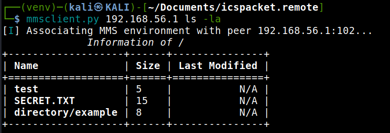
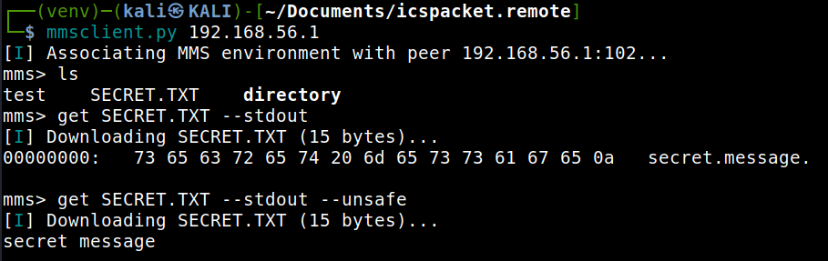
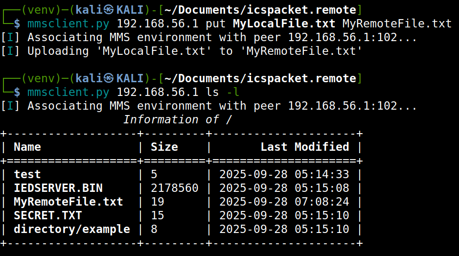

.. _mms_examples_client:

FileManagement Service
======================

The tool :file:`mmsclient.py` provides an **interactive shell** for exploring
and interacting with a remote MMS peer.

To start a new MMS client session, run:

.. code-block:: bash

    mmsclient.py [options] host [command [args...]]

You will be dropped into an interactive shell similar to this:

.. code-block:: text

    mms> help
    Documented commands (type help <topic>):
    ========================================
    cd    del    get    help   id    ldir
    ls    quit   rdir   rename ...

    mms>

.. tip::

    You can also invoke any of the documented commands below directly by
    specifying them **after** the host argument. For instance:

    .. code-block:: bash

        mmsclient.py <host> ls

.. tip::

    To view the help message for each implemented command, use ``--help``
    together with the command:

    .. code-block:: bash

        mmsclient.py --help ls
        Usage: ls [-h] [-l] [-a] [directory]

        positional arguments:
        directory   Remote directory to list (defaults to current remote directory)

        optional arguments:
        -h, --help  show this help message and exit
        -l          Print output as a list (table) instead of filenames only
        -a, --all   List all files, including ones in subdirectories

Listing Files (``ls``)
----------------------

Use the :code:`ls` command to list files in the current or a specified
directory on the remote MMS peer.

.. code-block::

    mms> ls [-l] [directory]
    test    SECRET.TXT    directory

By default, ``ls`` lists the contents of the current working directory.
Passing a directory name as an argument lists that directory instead.

.. note::
   The MMS peer's directory model may differ from a traditional POSIX
   filesystem. File names are constrained by the MMS File Service
   specifications.

Changing Directories (``cd``)
-----------------------------

The :code:`cd` command updates the current working directory context.

.. code-block:: bash

    mms> cd LOGS
    mms> ls
    SYS.LOG       ERROR.LOG     SESSION.DAT

Local vs Remote Directory Listings
----------------------------------

- ``ldir`` :octicon:`arrow-right` shows the **local filesystem** working dir (your machine).
- ``rdir``  :octicon:`arrow-right` shows the **remote peer filesystem** working dir.

This distinction is useful when comparing files before uploading or downloading.

.. tip::
   Use ``ldir`` before a :code:`get` to verify the local destination path.

Downloading Files (``get``)
---------------------------

The :code:`get` command retrieves a file from the remote MMS peer.

Arguments:

- ``remote_name`` :octicon:`arrow-right` The file name on the remote MMS peer (required).
- ``local_name`` :octicon:`arrow-right` The local destination file name (optional).
- ``--stdout`` :octicon:`arrow-right` Print the file content directly to
  standard output instead of saving. (hexdump)
- ``--unsafe`` :octicon:`arrow-right` Print out the file content directly.

Uploading Files (``put``)
---------------------------

The :code:`put` command transfers a local file to the remote MMS peer.

Arguments:

- ``local_name`` :octicon:`arrow-right` The local file name to transfer.
- ``remote_name`` :octicon:`arrow-right` The file name on the remote MMS peer (optional).

Deleting Files (``del``)
------------------------

The :code:`del` command removes a file from the remote MMS peer.

.. code-block:: bash

    mms> del TEMP.DAT
    mms> ls
    FILE_A.TXT    FILE_B.BIN