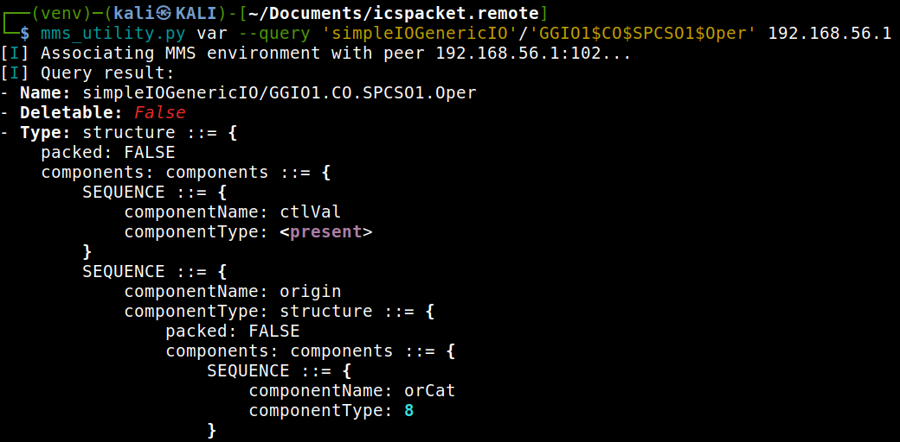
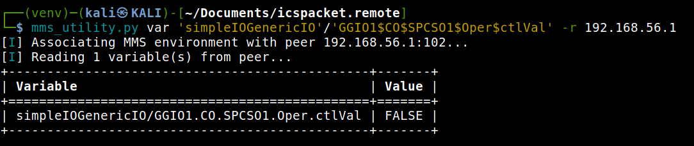

.. _mms_examples_variables:

Variable Target Format
======================

    A "variable" is an abstract element of the VMD that is capable of providing (when read) or accepting (when
    written), or both, a typed data value. A "type description" is an abstract description of the class of data that may be
    conveyed by a variable's value. A variable's type description determines its abstract syntax, its range of possible
    values, and its representation while being communicated using MMS.

    -- ISO 9506-1 14.1

Variables can be addressed using a **target string specification**.
The CLI accepts one of the following formats:

- ``<domain>/<variable>``
  Explicitly specifies both the domain and the variable name.

- ``<variable>``
  A shorthand notation where a global domain is provided via ``--domain``.

- ``vmd:<variable>``
  Custom VMD defined named variable.

- ``aa:<variable>``
  Custom AA (application association) defined named variable.

- or a path to a file containing lines with one of the formats mentioned above

Variables may be given as **inline arguments** or **read from a file**.
If the provided string is a path to a file, each non-empty line in that file
is treated as one variable target.

.. tip::

   In all ceses ``"."`` in variable names will be replaced with ``"$"`` to comply with the
   specification. For example:

   .. code-block:: bash

      mms_utility.py var --read DOMAIN_NAME/sensor.temperature <host>

   This will internally translate to the MMS variable name
   ``DOMAIN_NAME/sensor$temperature``.

.. warning::
    Only domain-specific variables are supported yet!

VariableAccess Service (rwq)
===========================================

The example tool provides three primary variable access services:

- **Query** (``--query``): Retrieve metadata about a variable (type, address, attributes).
- **Read** (``--read``): Retrieve the current value(s) of one or more variables.
- **Write** (``--write``): Modify the value of a variable.

Querying Variables
------------------

Use the ``--query`` flag to inspect the attributes of a variable.
This is especially useful to determine the variable’s data type before writing to it.

.. code-block:: bash

   mms_utility.py var --query <domain>/<valve_state> <host>

The response typically includes information such as:

- Variable type (e.g., ``BOOLEAN``)
- Address specification (if available)
- Access rights (if present)

   Even complex types will be shown.

Reading Variables
-----------------

To read variables from a remote MMS peer, use the ``--read`` flag.

.. code-block:: bash

   mms_utility.py var --read <domain>/<variable> <host>

Multiple variables may be specified:

.. code-block:: bash

   mms_utility.py var --read domain1/sensor1 domain1/sensor2 <host>

Or, if a global domain is defined:

.. code-block:: bash

   mms_utility.py var --domain domain1 --read sensor1 sensor2 <host>

The result is a list of ``AccessResult`` values for each variable.

Writing Variables
-----------------

Writing requires both the ``--write`` flag and a ``--value`` specification.

The ``--value`` follows the format ``<type>:<value>``.
Supported types are:

- ``str`` → VisibleString
- ``int`` → Integer
- ``float`` → FloatingPoint
- ``uint`` → Unsigned
- ``bool`` → BOOLEAN
- ``bits`` → BIT STRING
- ``oid`` → ObjectIdentifier
- ``mms-str`` → MMSString
- ``bytes`` → OCTET STRING

Example: writing a string value

.. code-block:: bash

   mms_utility.py var --write --value str:"Pump started" plant_data/status <host>

Example: writing an integer value

.. code-block:: bash

   mms_utility.py var --write --value int:42 domainA/counter <host>

Example: writing a boolean

.. code-block:: bash

   mms_utility.py var --write --value bool:true domainA/valve_state <host>

.. note::

    - For **binary/octet data**, pass hex-encoded strings or a file path.

.. warning::

    - **structured values** (arrays, structures) are not supported yet

.. raw:: html

    
